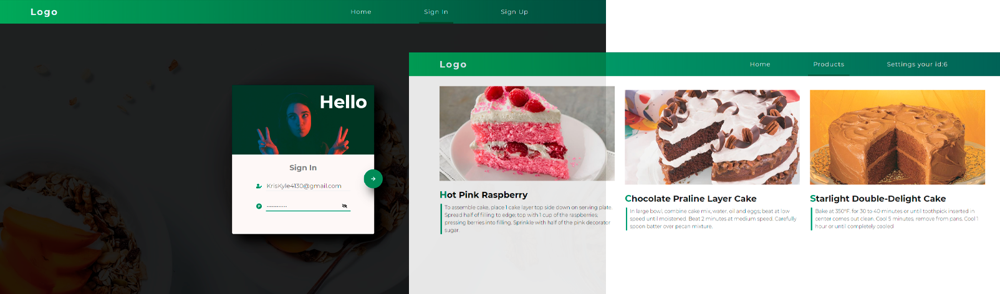

# Fullstack-ReactTS-GraphQL-TypeORM-PostgreSQL-APP
This is the alpha version of my app which uses authorization to login. in the future there will be recipes for products and the possibility of purchasing them with a payment system.

The way it look's like (Not finished ❗) 👇🏼



# How to use it ?

 - Create a Postgre Database and add your DB credentials to the ormconfig.json file
 - Create a file `.env` at the server of the project
 
 ```
.env file

ACCESS_TOKEN_SECRET=YOUR_SECRET_KEY
REFRESH_TOKEN_SECRET=YOUR_SECRET_KEY
```
- In order to run this project 
  - go to server folder -> open terminal and run the command ```npm run server```
  - go to frontend folder -> open terminal and run the command ```npm start```
---

### That's all :D
